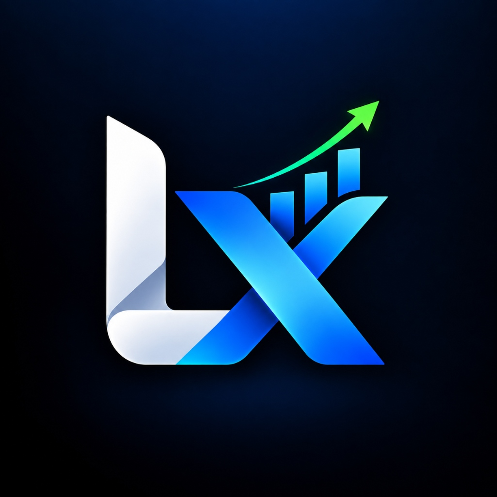

<div align="center">

  

  # ⚡ LedgerXL
  ### Enterprise-Grade Personal Wealth & Financial Intelligence Command Center

  <p align="center">
    A high-performance, cyber-fintech personal finance platform engineered with <strong>React 19</strong>, <strong>Vite</strong>, <strong>Tailwind CSS</strong>, <strong>Framer Motion</strong>, and a robust <strong>Node.js / Express + MongoDB</strong> backend.
  </p>

  <p align="center">
    <a href="https://github.com/PraneshKumar20/Expense-Tracker/stargazers"></a>
    <a href="https://github.com/PraneshKumar20/Expense-Tracker/network/members"></a>
    <a href="https://github.com/PraneshKumar20/Expense-Tracker/issues"></a>
    <a href="https://github.com/PraneshKumar20/Expense-Tracker/blob/main/LICENSE"></a>
  </p>

  <p align="center">
    
    
    
    
    
    
    
    
  </p>

</div>

---

## 📑 Table of Contents

- [Overview & Philosophy](#-overview--philosophy)
- [Key Features](#-key-features)
  - [Financial Command Center](#1-financial-command-center)
  - [Natural Language Quick-Add Bar](#2-natural-language-quick-add-bar)
  - [Interactive Visual Analytics](#3-interactive-visual-analytics)
  - [Category Envelopes & Zero-Based Budgets](#4-category-envelopes--zero-based-budgets)
  - [Subscription Radar & Recurring Obligations](#5-subscription-radar--recurring-obligations)
  - [Savings Goals & Milestone Milestones](#6-savings-goals--milestone-milestones)
  - [Enterprise Transaction Ledger & CSV Export](#7-enterprise-transaction-ledger--csv-export)
  - [Multi-Currency Real-time Engine](#8-multi-currency-real-time-engine)
  - [Adaptive Collapsible Sidebar & Mobile Navigation](#9-adaptive-collapsible-sidebar--mobile-navigation)
- [System Architecture](#-system-architecture)
- [Technology Stack](#-technology-stack)
- [Project Directory Structure](#-project-directory-structure)
- [Getting Started](#-getting-started)
  - [Prerequisites](#prerequisites)
  - [Installation](#installation)
  - [Environment Variables](#environment-variables)
  - [Running the Application](#running-the-application)
- [API Reference](#-api-reference)
- [Keyboard Shortcuts](#-keyboard-shortcuts)
- [Contributing](#-contributing)
- [License](#-license)

---

## 🌌 Overview & Philosophy

**LedgerXL** is crafted for individuals who want complete clarity, velocity, and command over their net worth and cashflow. Rather than static spreadsheets or sluggish accounting software, LedgerXL treats personal wealth like an operations flight deck:

- **Isolated Multi-User Security**: Complete data isolation across accounts via JWT / User ID tenancy.
- **Glassmorphism 2.0 & Cyber Aesthetics**: Designed with ambient glowing meshes, radial gradient backdrops, frosted cards, and dynamic spring physics.
- **Micro-Interactions**: Fluid number roll-up counters, reactive hover physics, canvas confetti celebrations, and contextual toasts.

---

## 🌟 Key Features

### 1. 🎛️ Financial Command Center
- **Live Net Balance HUD**: Instantly aggregates liquid balance with smooth spring-physics roll-up counters.
- **Financial Health Score**: Algorithmic financial health analysis calculating debt-to-income balance, savings rate, and spending velocity.
- **Income vs. Expense Ratio**: Proportional dual-gradient status bar showing real-time burn rate.
- **Spend Velocity & Insights**: Real-time savings rate calculation, average spend per transaction, and primary expense drivers.

### 2. ⚡ Natural Language Quick-Add Bar
- **Global Command HUD (`Ctrl + K`)**: Fire open the quick-add command line from anywhere in the application.
- **Smart Syntax Parsing**: Type natural expressions such as:
  ```text
  Dinner 45 Food
  Netflix 15.99 Entertainment recurring
  Freelance 1200 Income salary
  ```
- Instant extraction of description, numerical amount, category token, and recurring flags.

### 3. 📈 Interactive Visual Analytics
- **SVG Cashflow Velocity Charts**: Dual-gradient income (`#incomeGrad`) vs expense (`#expenseGrad`) bars powered by Recharts.
- **Category Donut with Outer Halo Physics**: Hovering any slice physically pops out the sector with ambient glow, while updating the synchronized central metrics HUD.
- **Two-Way Pill Interaction**: Hovering category pills highlights corresponding chart segments in real time.

### 4. 🎯 Category Envelopes & Zero-Based Budgets
- **User-Isolated Envelopes**: Allocate specific monthly limits for Food, Housing, Utilities, Subscriptions, and more.
- **Barber-Pole Animated Progress**: Visual spend progress bar transitions through green, amber, and crimson states as thresholds are approached.
- **Over-Budget Beacons**: Contextual alerts when spending crosses 80%, 90%, and 100% envelope capacities.

### 5. 📡 Subscription Radar & Recurring Obligations
- **Recurring Commitment Engine**: Tracks active software licenses, streaming services, and utility bills.
- **Renewal Alert Horizon**: Dynamic calculation of upcoming billing dates and monthly/yearly committed burn.
- **Quick Renewal Detection**: Automatically flags recurring items and offers one-click status audits.

### 6. 🏆 Savings Goals & Milestone Tracker
- **Visual Target Arcs**: Create custom wealth milestones (e.g., Emergency Fund, New Car, Real Estate Down Payment).
- **Deposit Tracking**: Staggered deposit histories with projected completion dates.
- **Victory Celebrations**: Micro-confetti fireworks powered by `canvas-confetti` upon reaching target amounts.

### 7. 📑 Enterprise Transaction Ledger & CSV Export
- **Instant Search**: Sub-millisecond filtering across descriptions and notes.
- **Multi-Dimension Filters**: Filter by transaction type (*All, Income, Expense*), category, or date range.
- **Chronological Sorting**: Instant ascending / descending sort toggles.
- **One-Click CSV Export**: Clean RFC-4180 compliant CSV export for spreadsheet import or tax filings.

### 8. 💱 Multi-Currency Real-time Engine
- **Instant Currency Switcher**: Seamless conversion between **USD ($)** and **INR (₹)**.
- **Sliding Spring Pill**: Framer Motion `layoutId` pill transition with dynamic rate calculations across all screens.

### 9. 📱 Adaptive Collapsible Sidebar & Mobile Navigation
- **Collapsible Sidebar**: Desktop sidebar toggles between expanded navigation and compact icon-rail mode with hover tooltips.
- **Mobile Responsive Drawer**: Glassmorphic slide-out navigation with quick links and touch-friendly controls.

---

## 🏗️ System Architecture

```
┌─────────────────────────────────────────────────────────────┐
│                       LEDGERXL UI                         │
│   React 19 + Vite + Tailwind CSS + Framer Motion + Recharts  │
└──────────────────────────────┬──────────────────────────────┘
                               │ Axios REST API (JSON)
                               ▼
┌─────────────────────────────────────────────────────────────┐
│                    EXPRESS.JS BACKEND                       │
│      Auth Controller | Expense Controller | User Tenancy    │
└──────────────────────────────┬──────────────────────────────┘
                               │ Mongoose ODM
                               ▼
┌─────────────────────────────────────────────────────────────┐
│                     MONGODB DATABASE                        │
│             Users Collection | Expenses Collection          │
└─────────────────────────────────────────────────────────────┘
```

---

## 🛠️ Technology Stack

### Client-Side (Frontend)
| Technology | Version | Purpose |
| :--- | :--- | :--- |
| **React** | `19.2.0` | UI component architecture & concurrent rendering |
| **Vite** | `7.2.4` | Lightning-fast build tooling and HMR dev environment |
| **Tailwind CSS** | `3.4.19` | Atomic styling, custom design tokens, cyber-fintech theme |
| **Framer Motion** | `13.1.0` | Spring physics, layout animations, and gesture triggers |
| **Recharts** | `3.10.1` | Responsive SVG charts with custom linear gradients |
| **Radix UI** | Latest | Accessible unstyled primitives (Dialog, Select, Popover) |
| **Lucide React** | `1.31.0` | Modern fintech iconography |
| **Canvas Confetti**| `1.9.4` | Celebratory milestone visual effects |
| **Axios** | `1.13.2` | Promise-based HTTP client |

### Server-Side (Backend)
| Technology | Version | Purpose |
| :--- | :--- | :--- |
| **Node.js** | `>= 18.0.0` | JavaScript runtime environment |
| **Express.js** | `4.22.1` | RESTful API routing and middleware orchestration |
| **MongoDB** | `>= 6.0` | High-performance document database |
| **Mongoose** | `9.1.2` | Object Data Modeling (ODM) with strict schemas |
| **Bcrypt.js** | `3.0.3` | Password hashing and cryptographic verification |
| **Concurrently**| `10.0.5` | Unified root command orchestration |

---

## 📂 Project Directory Structure

```
ExpenseTracker/
├── client/                             # React 19 Frontend
│   ├── public/
│   │   ├── ledgerxl-logo.png         # Official logo & favicon asset
│   │   └── vite.svg
│   ├── src/
│   │   ├── api/                        # Axios HTTP client configuration
│   │   ├── components/
│   │   │   ├── Dashboard/              # Command Center Views
│   │   │   │   ├── AnalyticsView.jsx   # In-depth spending analytics
│   │   │   │   ├── BudgetsView.jsx     # Envelope budget manager
│   │   │   │   ├── Dashboard.jsx       # Root layout coordinator
│   │   │   │   ├── FinancialHealthCard.jsx # Health algorithm HUD
│   │   │   │   ├── OverviewView.jsx    # Primary command center
│   │   │   │   ├── QuickAddCommand.jsx # NLP Quick-Add Command Bar
│   │   │   │   ├── SavingsGoalsModal.jsx # Milestones tracker
│   │   │   │   ├── SubscriptionRadarModal.jsx # Recurring tracker
│   │   │   │   ├── SubscriptionsView.jsx # Subscription dashboard
│   │   │   │   ├── TransactionModal.jsx # Add / Edit transaction dialog
│   │   │   │   ├── TransactionTable.jsx # Interactive data table
│   │   │   │   └── TransactionsView.jsx # Dedicated ledger view
│   │   │   ├── Layout/
│   │   │   │   ├── AppHeader.jsx       # Header with sidebar trigger & currency
│   │   │   │   ├── MobileNav.jsx       # Responsive drawer overlay
│   │   │   │   └── Sidebar.jsx         # Collapsible desktop navigation
│   │   │   ├── Login/                  # Authentication view
│   │   │   ├── Signup/                 # Registration view
│   │   │   └── ui/                     # Primitives (Buttons, Cards, Badges)
│   │   ├── utils/
│   │   │   ├── categoryColors.js       # Canonical category color palette
│   │   │   └── quickAddParser.js       # Natural language parser
│   │   ├── App.jsx                     # Route definitions & state
│   │   ├── index.css                   # Glassmorphism & custom utility tokens
│   │   └── main.jsx                    # Application entrypoint
│   ├── index.html                      # HTML5 template with Geist & Manrope fonts
│   ├── package.json
│   ├── tailwind.config.js
│   └── vite.config.js
├── server/                             # Express.js Backend
│   ├── config/
│   │   └── db.js                       # Mongoose database connector
│   ├── controllers/
│   │   ├── authController.js           # User registration & login handlers
│   │   └── expenseController.js        # User-isolated CRUD expense operations
│   ├── models/
│   │   ├── Expense.js                  # Expense schema with user tenancy
│   │   └── User.js                     # User account & credential schema
│   ├── routes/
│   │   ├── authRoutes.js               # Auth API route definitions
│   │   └── expenseRoutes.js            # Expense API route definitions
│   ├── package.json
│   └── server.js                       # Express app bootstrap & middleware
├── package.json                        # Root orchestration package
├── vercel.json                         # Vercel deployment configuration
└── README.md                           # Documentation
```

---

## 🚀 Getting Started

Follow these steps to set up and run LedgerXL on your local development machine.

### Prerequisites

Ensure you have the following installed:
- [Node.js](https://nodejs.org/) (v18.0.0 or higher recommended)
- [npm](https://www.npmjs.com/) (v9.0.0 or higher)
- [MongoDB Community Server](https://www.mongodb.com/try/download/community) (running locally on port `27017` or a [MongoDB Atlas](https://www.mongodb.com/atlas) connection URI)

### Installation

1. **Clone the repository:**
   ```bash
   git clone https://github.com/PraneshKumar20/LedgerFlow.git
   cd LedgerFlow
   ```

2. **Install all dependencies (Root, Client & Server):**
   ```bash
   npm run install:all
   ```

### Environment Variables

Create a `.env` file in the `server` directory:

```bash
# Path: server/.env
PORT=5000
MONGO_URI=mongodb://127.0.0.1:27017/expense_tracker
```

*(Optional: If connecting to MongoDB Atlas, replace `MONGO_URI` with your connection string).*

### Running the Application

Launch both the Express backend API and the Vite frontend dev server with a single unified command:

```bash
npm run dev
```

Once started:
- 🌐 **Frontend**: [http://localhost:5173](http://localhost:5173)
- ⚙️ **Backend API**: [http://localhost:5000](http://localhost:5000)

#### Individual Service Scripts:
```bash
# Start only the client
npm run dev:client

# Start only the backend (with nodemon auto-restart)
npm run dev:server

# Build the client for production
npm run build
```

---

## 🔌 API Reference

### Authentication (`/api/auth`)
| Method | Endpoint | Description | Payload |
| :--- | :--- | :--- | :--- |
| `POST` | `/api/auth/register` | Create a new user account | `{ username, email, password }` |
| `POST` | `/api/auth/login` | Authenticate existing user | `{ email, password }` |

### Expenses (`/api/expenses`)
| Method | Endpoint | Description | Payload |
| :--- | :--- | :--- | :--- |
| `GET` | `/api/expenses?userId={id}` | Retrieve all transactions for user | None |
| `POST` | `/api/expenses` | Create a new transaction | `{ title, amount, category, type, date, isRecurring, userId }` |
| `PUT` | `/api/expenses/:id` | Update an existing transaction | `{ title?, amount?, category?, type?, date? }` |
| `DELETE` | `/api/expenses/:id` | Remove a transaction | None |

---

## ⌨️ Keyboard Shortcuts

| Shortcut | Action | Scope |
| :--- | :--- | :--- |
| `Ctrl + K` / `Cmd + K` | Open Natural Language Quick-Add HUD | Global |
| `Esc` | Close modal / Dismiss command HUD | Any Modal / Drawer |
| `Enter` | Submit Quick-Add entry | Quick-Add Input |

---

## 🤝 Contributing

Contributions, issues, and feature requests are welcome!

1. Fork the Project
2. Create your Feature Branch (`git checkout -b feature/AmazingFeature`)
3. Commit your Changes (`git commit -m 'feat: Add some AmazingFeature'`)
4. Push to the Branch (`git push origin feature/AmazingFeature`)
5. Open a Pull Request

---

## 📄 License

This project is licensed under the [ISC License](LICENSE).

---

<div align="center">
  Crafted with precision by <a href="https://github.com/PraneshKumar20"><strong>Pranesh Kumar</strong></a>
</div>
